# **How to apply the face mask model trained by AIBOX to Yanshee robot**
Please right-click to preview this document

## **Core Goal**

Convert the .pth model trained by pytorch on AIBOX to the .param and .bin models of ncnn

## **1. Aibox generates the original .onnx file**

1. Add sample training to generate a .pth file (AIBOX training project equipped with the mask_train folder)
2. Generate the original .onnx model
3. Put the model_create.py script into the train folder in the mask_train folder

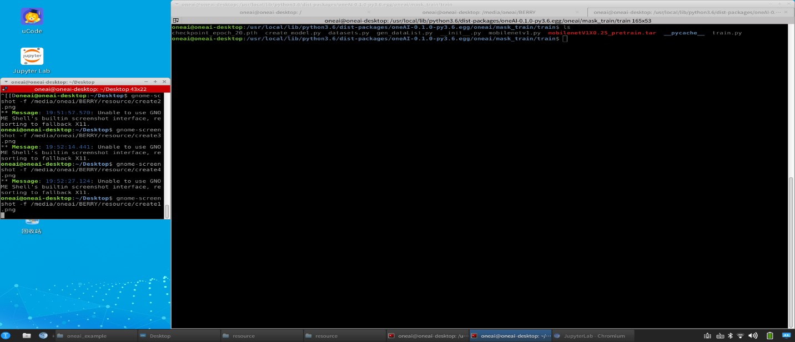

Execute the following command to copy to the mask_train folder

```
sudo cp (model_create.py path) /usr/local/lib/python3.6/dist-packages/oneAI-0.1.0-py3.6.egg/oneai/mask_train/train
```


4. Modify the parameter in model_create.py and run model_create.py according to the current AIBOX model position and training parameters

Parameters that may be modified:

a. Model_path: Full path of the generated pytorch model

b. dummy_input: The last two 224; the value cannot exceed the limit according to your actual training set image resolution, but it should be consistent with the last ncnn reasoning (ncnn.cpp in the compressed package)

c. input_names: Input layer name, which can be accessed by the user as needed, but should be consistent with the last ncnn reasoning (ncnn.cpp in the compressed package) input

d. output_names: Output layer name, which can be accessed by the user as needed, but should be consistent with the last ncnn reasoning (ncnn.cpp in the compressed package) input

e. export_onnx_file:.onnx model name, which can be accessed by the user as needed

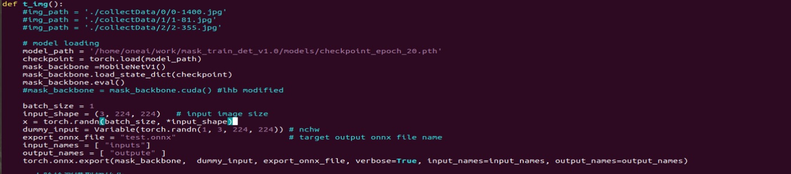

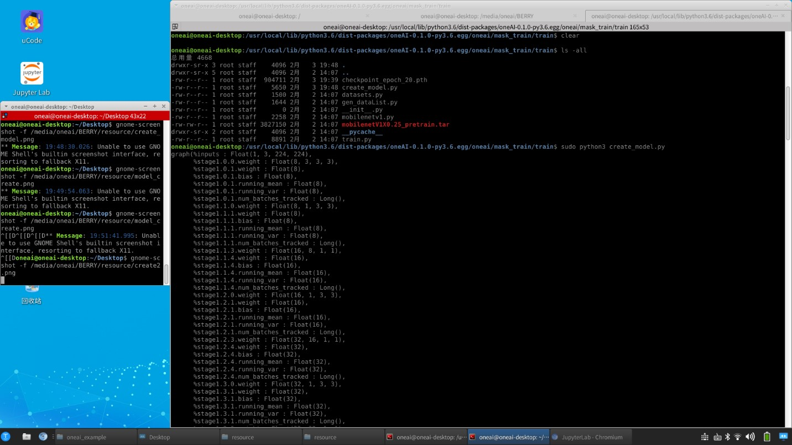

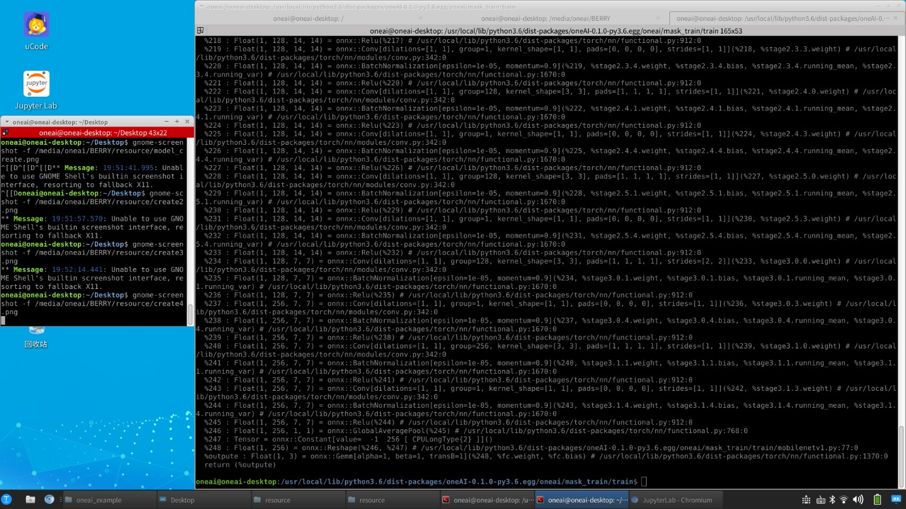

## **2. Simplify the original .onnx model on Yanshee**

The .onnx model dimension converted from pytorch has redundancy, so onnxsim needs to be used to simplify the .onnx model; otherwise the ncnn loading model may report an error.

Note: Perform all pip installation operations (ensure that the offline installation takes effect without downloading the installation package again) as the root user

Run the following command to enter the mode of root user

```
sudo -s
```

Exit root user

```
exit
```

1. First use our service to reduce resource consumption (please disable other operations that occupy CPU and memory). Run the following command on Yanshee

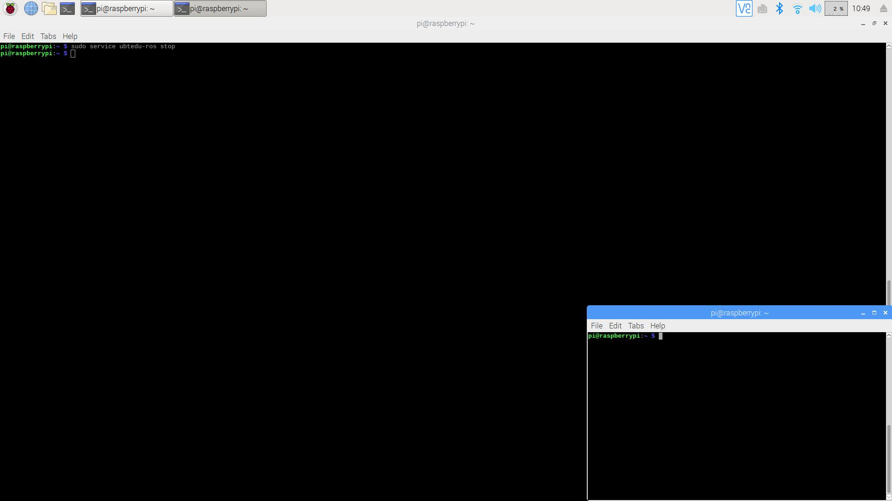

```
sudo service ubtedu-ros stop
```

Run the following command to check whether our service is stopped
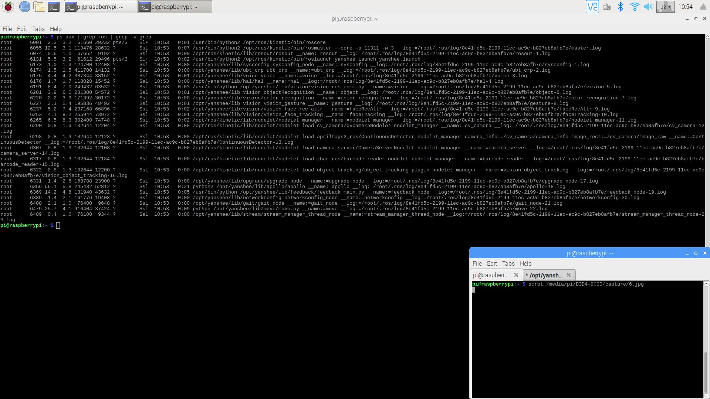

```
ps aux | grep ros | grep -v grep
```

If it does not take effect, you can run the following command to forcibly stop our service

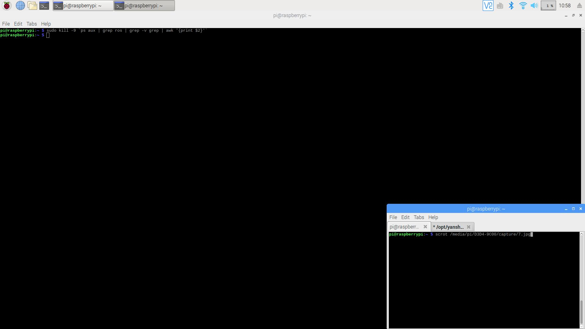

```
sudo kill -9 `ps aux | grep ros | grep -v grep | awk '{print $2}'`
```

2. Run the following command to install protobuf

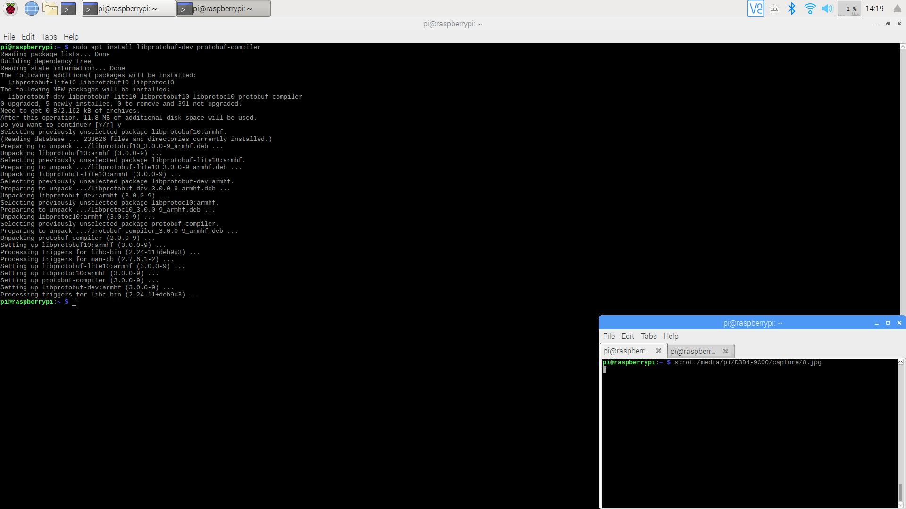

```
sudo apt install libprotobuf-dev protobuf-compiler
```

3. Downlaod numpy,onnxruntime to /home/pi

url:

[h](https://www.piwheels.org/simple/numpy/numpy-1.18.5-cp35-cp35m-linux_armv7l.whl)[ttps://www.piwheels.org/simple/numpy/numpy-1.18.5-cp35-cp35m-linux_arm](https://www.piwheels.org/simple/numpy/numpy-1.18.5-cp35-cp35m-linux_armv7l.whl)[v](https://www.piwheels.org/simple/numpy/numpy-1.18.5-cp35-cp35m-linux_armv7l.whl)[7l.whl](https://www.piwheels.org/simple/numpy/numpy-1.18.5-cp35-cp35m-linux_armv7l.whl)(numpy)

Enter the numpy website in the browser to start downloading.

[https://github.com/raspberry4faith/built-onnxruntime-for-raspberrypi-linux/blob/master](https://github.com/raspberry4faith/built-onnxruntime-for-raspberrypi-linux/blob/master/wheels/stretch/onnxruntime-1.3.0-cp35-cp35m-linux_armv7l.whl)[/](https://github.com/raspberry4faith/built-onnxruntime-for-raspberrypi-linux/blob/master/wheels/stretch/onnxruntime-1.3.0-cp35-cp35m-linux_armv7l.whl)[wheels/stretch/onnxruntime-1.3.0-cp35-cp35m-linux_armv7l.whl](https://github.com/raspberry4faith/built-onnxruntime-for-raspberrypi-linux/blob/master/wheels/stretch/onnxruntime-1.3.0-cp35-cp35m-linux_armv7l.whl)(onnxruntime)

Open the onnxruntime website in the browser and click “Download”.

4. Run the following command in the /home/pi directory of Yanshee to install numpy1.18.5

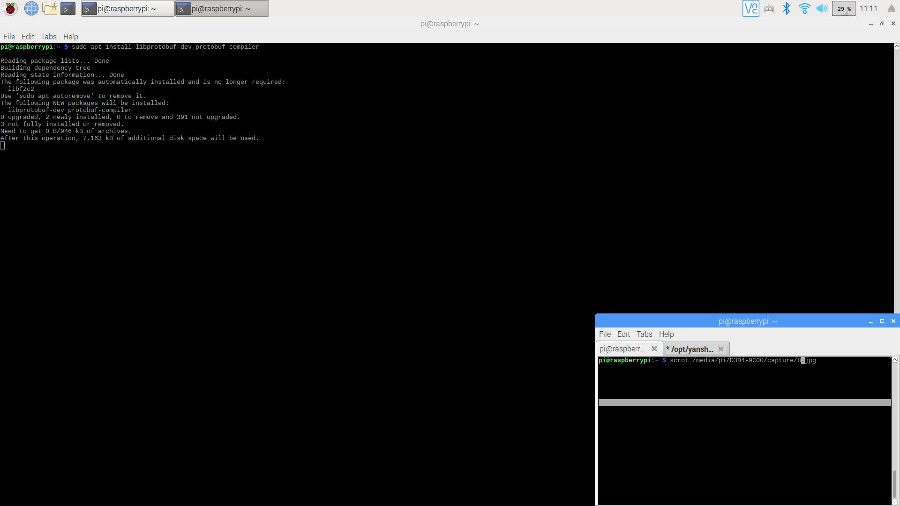

```
pip3 install /home/pi/numpy-1.18.5-cp35-cp35m-linux_armv7l.whl
```

5. Run the following command in the /home/pi directory of Yanshee to install onnxruntime

This step involves compilation and takes a long time. If the downloading of some packages is too slow, manually download them through url and install them (for details, please copy the url displayed on the command line ). For the installation command, refer to 4). At present, only numpy will disconnect the download link, and the other packages can be downloaded normally through Rraspberry Pi


```
pip3 install /home/pi/onnxruntime-1.3.0-cp35-cp35m-linux_armv7l.whl
```

6. Run the command to install onnx-simplfier (which can be obtained by conversion currently after version 0.2.18 is used for simplification)

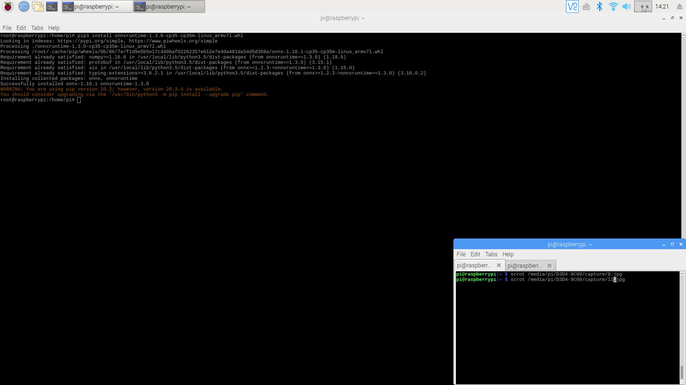

```
pip3 install onnx-simplifier==0.2.18
```

7. Model copy

Keep Yanshee and AIBOX on the same Wi-Fi network, and run the following command in AIBOX to remotely copy the onnx model output by pytorch to the Yanshee/home/pi directory. Here, the USB drive can also be directly used for copying or other methods can be used.

Yanshee password: raspberry

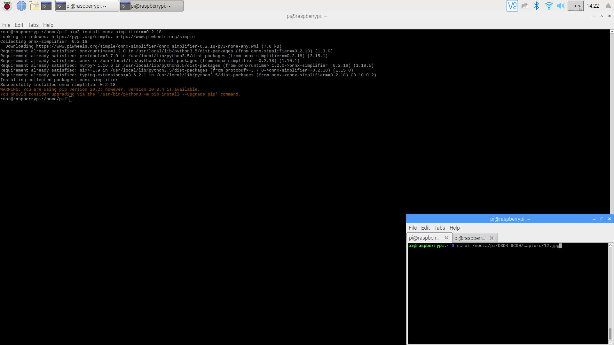

```
scp (full path of the onnx model output through pytorch) pi@(Yanshee的ip):~/
```

8. Run the simplify command to generate a simplified model to /home/pi

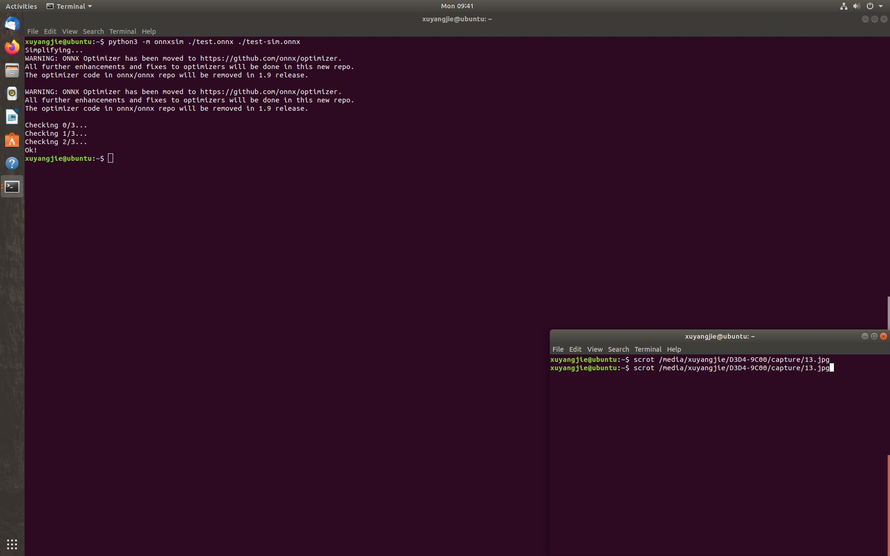

```
python3 -m onnxsim /home/pi/(onnx model name) /home/pi/(new onnx model name)
```

## **3. On Yanshee, install ncnn to the /home/pi directory and generate the ncnn model**

1. Create a new terminal window and run the command to clone the ncnn code warehouse (or manually download and extract it to /home/pi)

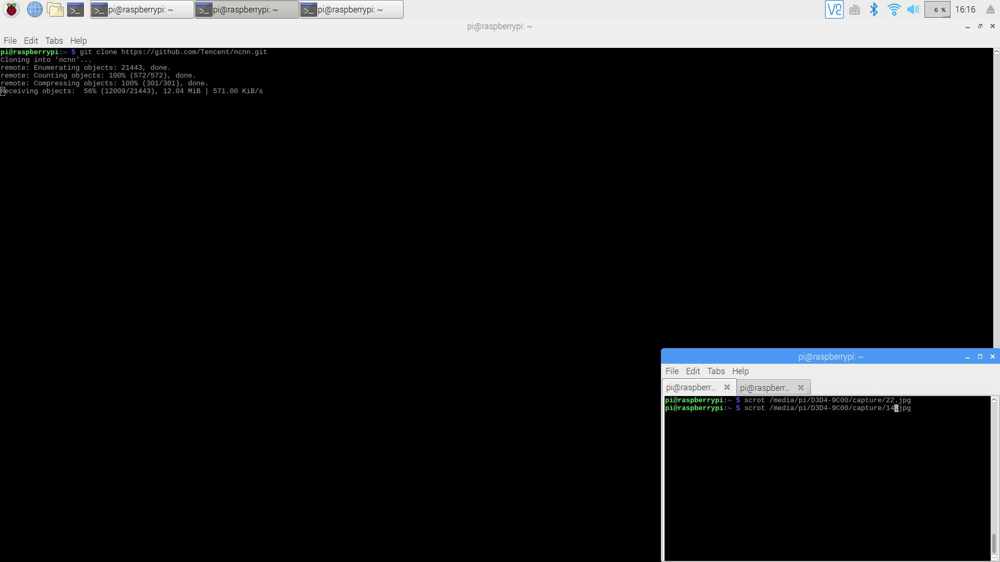

```
git clone https://github.com/Tencent/ncnn.git
```

2. Run the command to enter the downloaded ncnn directory


```
cd /home/pi/ncnn
```

3. Run the command to create a build directory and enter the directory

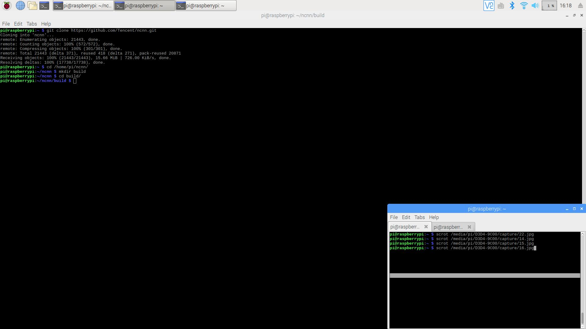

```
mkdir build/

cd build/
```
4. Execute command compilation and installation

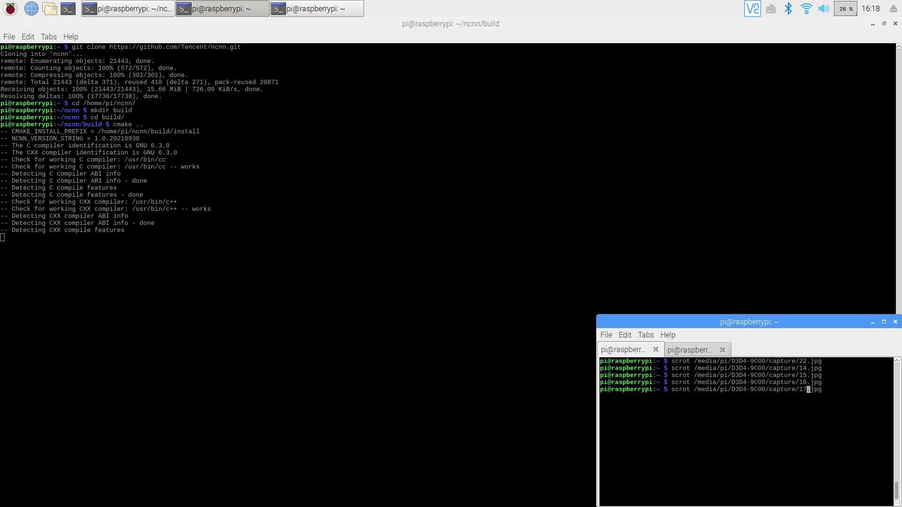

```
cmake../
```

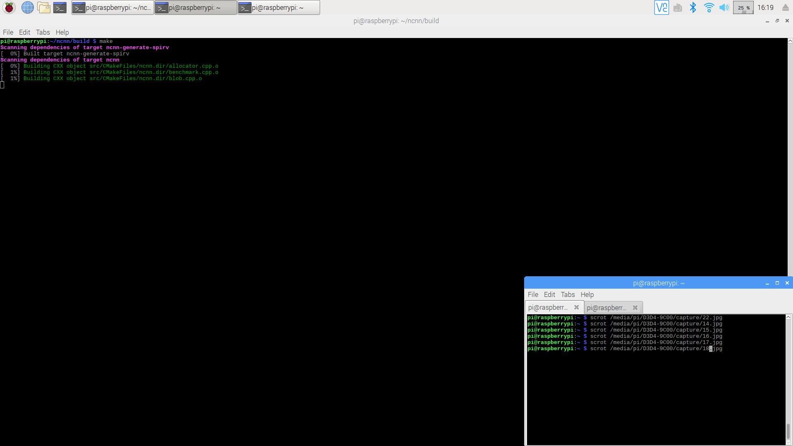

```
make
```

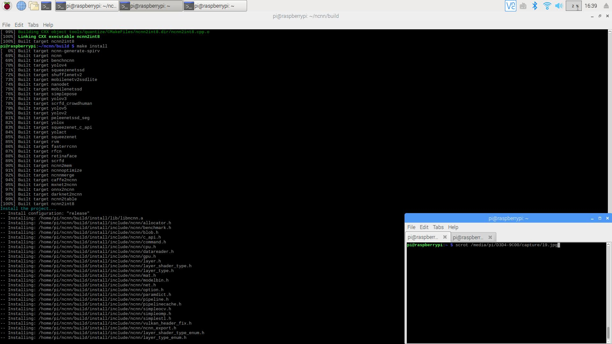

```
make install
```

5. Execute the onnx2ncnn file

After installation in the build directory, a tools folder is generated, and there is an onnx folder under the tools folder, containing an onnx2ncnn executable file. Run the following command to enter this directory and generate a model in the current directory. Now, model file generation is completed.

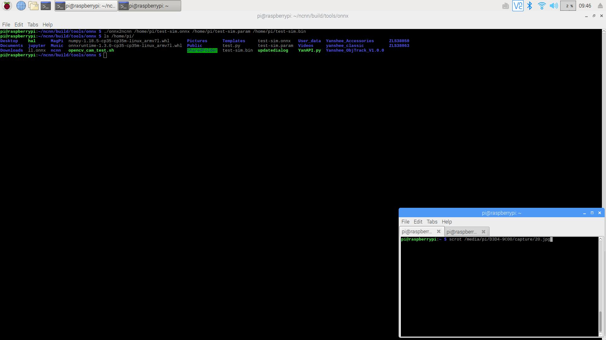

```
cd /home/pi/ncnn/build/tools/onnx/

./onnx2ncnn (path of simplified onnx model) (ncnn model name).param (ncnn model name).bin
```
